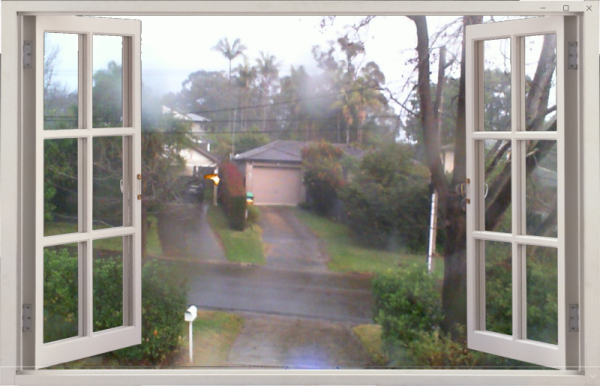

# VWindow
A virtual window showing a preview from a camera feed.

## Introduction

I have a few old USB web cameras and thought I could put one to use. While I work at my desk it is nice to be able to quickly glance outside the front of the house when I hear a vehicle pull up, however my desk is not facing the window at the front of the building. Using a long USB extension cable I can glance at a window on my desktop and see the view outside my window.
I decided to add a window frame to complete the illusion of looking out of the window.




## The Code

This is a simple UWP C# app using the [_MediaCapture_](https://docs.microsoft.com/uwp/api/windows.media.capture.mediacapture) class.

### The Interface 
The MainPage layout contains a Grid with:
1. A [**CaptureElement**](https://docs.microsoft.com/uwp/api/Windows.UI.Xaml.Controls.CaptureElement), named *previewElement*
2. An [**Image**](https://docs.microsoft.com/uwp/api/windows.ui.xaml.controls.image), named *FrameView*
3. A [**ComboBox**](https://docs.microsoft.com/uwp/api/windows.ui.xaml.controls.combobox), named *CameraList*

The *previewElement* **CaptureEleement** will display the preview video stream from the camera.
The *FrameView* **Image** will display the window frame image over the camera image
The *CameraList* **ComboBox** will show a list of cameras attached ot the PC, this lets you select the camera you want to use for the window.

```cs
<Grid>
    <CaptureElement x:Name="previewElement" HorizontalAlignment="Stretch" Visibility="Visible"/>
    <Image x:Name="FrameView" Stretch="Fill" Source="/Assets/Frames/white_open.png"  />
    <ComboBox x:Name="CameraList" VerticalAlignment="Bottom" HorizontalAlignment="Stretch" 
        Background="Transparent"
        Height="40" SelectionChanged="CameraList_SelectionChanged" />
</Grid>
```

### The Code Behind

To populate the list of camera available to stream video on a PC I use the [**MediaFrameSourceGroup**](https://docs.microsoft.com/uwp/api/windows.media.capture.frames.mediaframesourcegroup) class. The [**FindAllAsync**](https://docs.microsoft.com/uwp/api/windows.media.capture.frames.mediaframesourcegroup.findallasync) method retrieves a list of the available media frame source groups on the current device. This list is used to populate the *CameraList* **ComboxBox**.

```cs
public async Task<List<string>> GetAllDevices()
{
    List<String> deviceNames = new List<string>();
    var frameSourceGroups = await MediaFrameSourceGroup.FindAllAsync();
    foreach(var group in frameSourceGroups)
    {
        deviceNames.Add(group.DisplayName);
    }	

    return deviceNames;
}
```

When a camera is selected from the **ComboBox** the name is used to look up the **MediaFrameSourceGroup** for the selected camera. The selected **MediaFrameSourceGroup** is then checked that is can provide a video stream we can use to display on the screen.

```cs
public async Task<MediaFrameSourceGroup> GetMediaDeviceGroup(string deviceName)
{
    var frameSourceGroups = await MediaFrameSourceGroup.FindAllAsync();

    MediaFrameSourceGroup selectedGroup = null;
    colorSourceInfo = null;

    foreach (var sourceGroup in frameSourceGroups)
    {
        if (deviceName == sourceGroup.DisplayName)
        {
            foreach (var sourceInfo in sourceGroup.SourceInfos)
            {
                if (sourceInfo.MediaStreamType == MediaStreamType.VideoPreview
                    || sourceInfo.MediaStreamType == MediaStreamType.VideoRecord
                    )
                {
                    colorSourceInfo = sourceInfo;
                    break;
                }
            }
            if (colorSourceInfo != null)
            {
                selectedGroup = sourceGroup;
                break;
            }
        }
    }
    return selectedGroup;
}
```

Once a **MediaFrameSourceGroup** has been found as the *device* selected, it can be used to initialize a [**MediaCapture**](https://docs.microsoft.com/uwp/api/windows.media.capture.mediacapture) object. This **MediaCapture** object is then used as the source of the *previewElement* **Image** to display the camera feed on the screen.

You can see a few other settings are used in the [**MediaCaptureInitializationSettings**](https://docs.microsoft.com/uwp/api/windows.media.capture.mediacaptureinitializationsettings). Setting the *SharingMode* to *SharedReadOnly* allows other programs to use the camera in a non-exclusive way. The *StreamingCaptureMode* is set to *Video* to provide a video preview stream.

Finally once the **Image.Source** has been set to the **MediaCapture** object, the [**StartPreviewAsync**](https://docs.microsoft.com/uwp/api/windows.media.capture.mediacapture.startpreviewasync) method is called to start streaming the video preview through the **MediaCapture** object into the **Image**.

```cs
private async Task SetCameraView(string selected)
{
    var device = await GetMediaDeviceGroup(selected);
    MediaCaptureInitializationSettings settings = new MediaCaptureInitializationSettings
    {
        SourceGroup = device,
        SharingMode = MediaCaptureSharingMode.SharedReadOnly,
        MemoryPreference = MediaCaptureMemoryPreference.Cpu,
        StreamingCaptureMode = StreamingCaptureMode.Video
    };


    mediaCapture = new MediaCapture();
    await mediaCapture.InitializeAsync(settings);
    previewElement.Source = mediaCapture;
    await mediaCapture.StartPreviewAsync();
}
```

If you browse the rest of the code in this repo you will notice a small number of other tweaks that make the app more useful. The main functionality for getting the camera feed, and rendering it on the screen is all the code described in this document.


